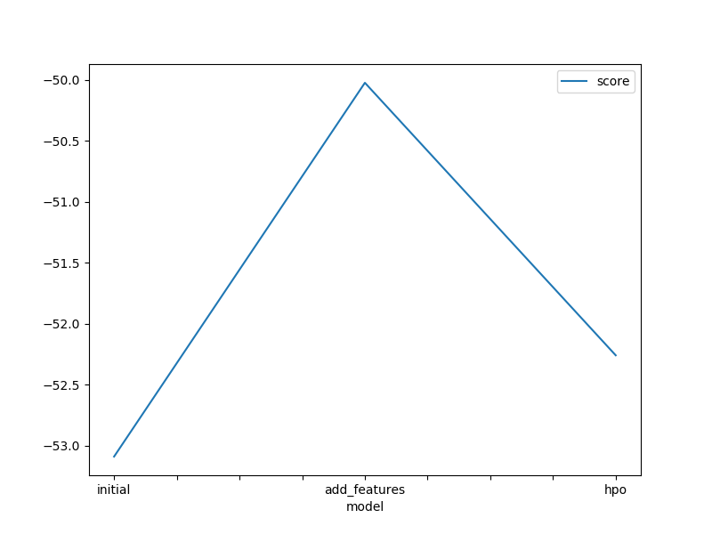
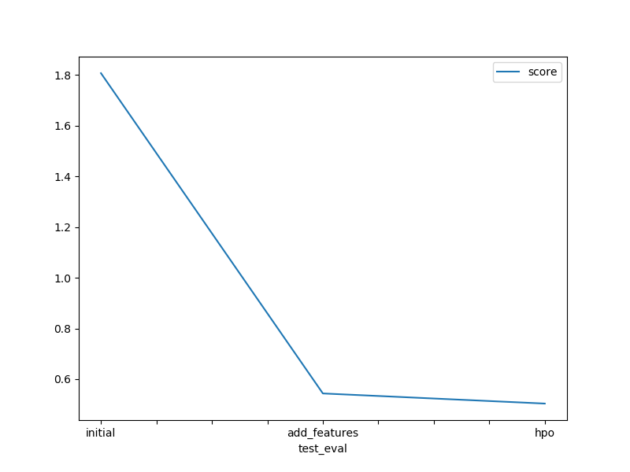

# Report: Predict Bike Sharing Demand with AutoGluon Solution
#### ZENRET ORSE BAKLE

## Initial Training
### What did you realize when you tried to submit your predictions? What changes were needed to the output of the predictor to submit your results?
I followed the instructions in the notebook, and i was able to submit. I didn't have any nagative values in my predictions and so there was no need to set them to zero. 

### What was the top ranked model that performed?
The top ranked model for my initial training was **WeightedEnsemble_L3**  with a score_value of **-53.088383**

## Exploratory data analysis and feature creation
### What did the exploratory analysis find and how did you add additional features?
after exploring the data, I found that the training set data had 12 features and 10886 rows. of all the columns in the dataset, only datetime column was of type datetime the rest were either of type floats or ints. The target/response variable didn't have a strong correlation with any the predictors. further more, the two columns *season* and *weather* were coded as numerical values and not as the categorical data they were describe to be in kaggle. Aside from the test set having 6493 rows 9 columns. it had similar characteristics like the training set.
 
Additional features were added or created from the datetime column. using the .dt attribute, 3 new columns *hour*, *day*, *month* were created and added to the dataframe for training.

### How much better did your model preform after adding additional features and why do you think that is?
The best performing model WeightedEnsemble_L3  had a score value of -50.025 which better than the last socre_value. The first reason for the improvement can be attributed to setting the *season* and *weather*  columns to categories and the second reason can be the addition of new features.

## Hyper parameter tuning
### How much better did your model preform after trying different hyper parameters?
The model was better than the initial model but not better than the last model.

### If you were given more time with this dataset, where do you think you would spend more time?
I will spend more time finding the optimal features and tuning the hyper parameters.

### Create a table with the models you ran, the hyperparameters modified, and the kaggle score.
|model|hpo1|hpo2|hpo3|score|
|--|--|--|--|--|
|initial|default|default|default|1.80755|
|add_features|default|default|default|0.54343|
|hpo|GBM|RF|XGB|0.50354|

### Create a line plot showing the top model score for the three (or more) training runs during the project.

### Create a line plot showing the top kaggle score for the three (or more) prediction submissions during the project.

## Summary

Of all the models trained, the one with add_features did best followed by the Hpo and finally, the initial model. all the scores were submitted to Kaggle for rating.

